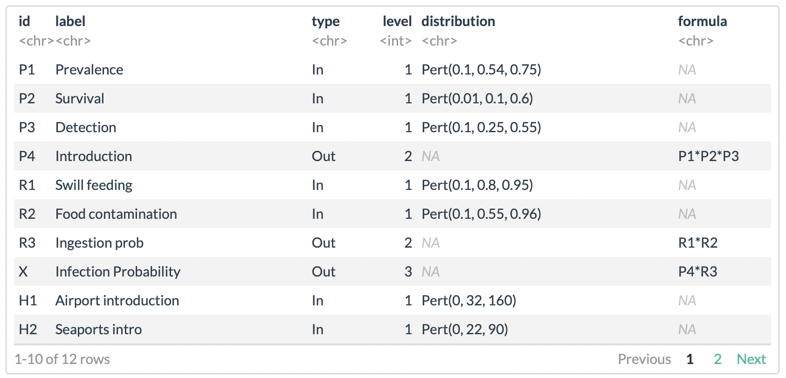
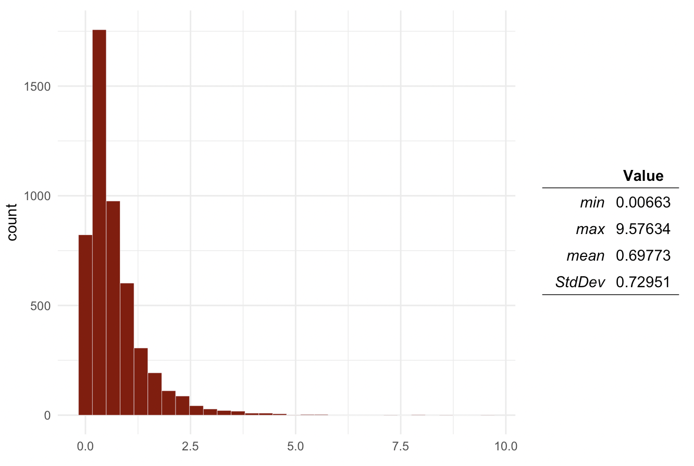
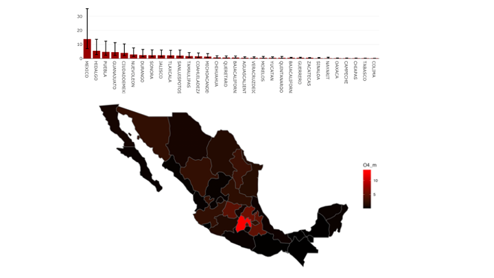
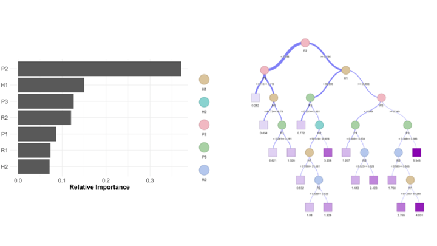

# {quantrra} 

`{quantrra}` is a package for rapid risk assessment developed for the statistical software R.

# Installing quantrra

You can install `quantrra` development version from [GitHub](https://github.com/jpablo91/quantrra) using the following code in your R console (make sure you have R > 3.5):

```r
# make sure you have the package devtools installed
devtools::install_github('spablotemporal/quantrra')
```

# Getting started

`quantrra` was developed for the implementation of stochastic probabilistic risk assessment models as an open access alternative to software such as [@Risk](https://www.palisade.com/risk/). `quantrra` provides a set of functions to be used in R, and also offers a more user friendly interface trough shiny that can be accessed using:

```r
quantrra::run_quantrra()
```


## Main usage

The main usage for quantrra is to simulate stochastic events using the function `rra()`, which requires two arguments:  
  
  - **M**, the model file
  - **n** number of simulations.  
  
A model file is just a data.frame with rows that represent inputs and outputs of the model. The columns include ID, label, whether the event is input or output, a distribution (for inputs), and a formula (for outputs).  



The model file then can created in using the shiny interface, R or other software editors. The idea behind model files is that can be easy to share and modify.  

```r
# Load a model file from the package
M <- quantrra::OIRSA_M
# Run the model 5000 times
Mo <- rra(M = M, nsim = 5000)
# Visualize the results:
plotDist(Mo$P)
```



# Other features

quantrra also provides functions to evaluate the model and creating stratified models to estimate regional or strata-specific risk estimation of events. see the package [example](https://cadms-ucd.github.io/Teaching/224_Lab7.html) for more information.







