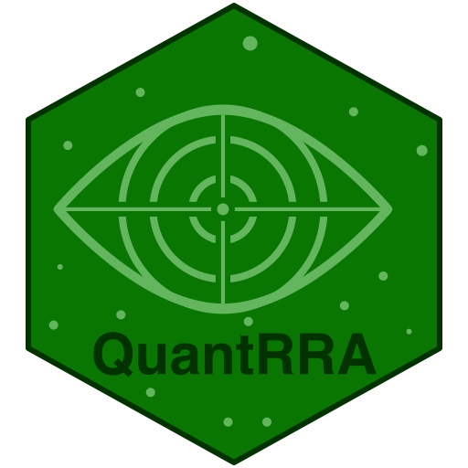

# {QuantRRA} 

`{QuantRRA}` is a package for rapid risk assessment developed for the statistical software R.

# Installing QuantRRA

You can install `QuantRRA` development version from [GitHub](https://github.com/jpablo91/QuantRRA) using the following code in your R console (make sure you have R > 3.5):

```r
# make sure you have the package devtools installed
devtools::install_github("jpablo91/QuantRRA")
```

# Getting started

see the package [vignette](vignettes/GettingStarted.Rmd) to get started
