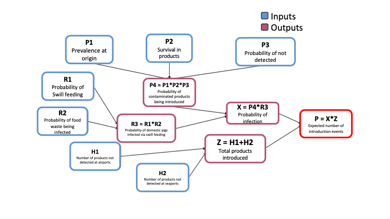
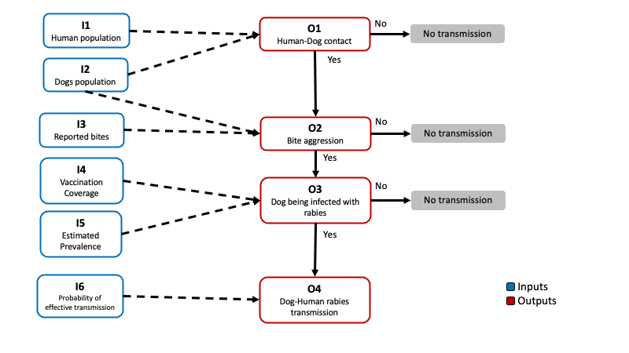

```{r gloabl options, include = F}
knitr::opts_chunk$set(warning = F, message = F)
```


# Objectives

In this vignette we will be using the library `QuantRRA` for rapid risk assessment (still under development).  Make sure you have installed the latest version of [R](https://cloud.r-project.org), [Rstudio](https://www.rstudio.com/products/rstudio/), and [QuantRRA](https://github.com/jpablo91/QuantRRA). If you don't want/can't install R and Rstudio in your local machine, you can create a free account of [Rstudio cloud](http://rstudio.cloud/) and use a cloud server to run the code. The objectives for this vignette are:  

  - Familiarize with methods to develop risk assessment using R
  - Integrate qualitative and quantitative information for the development of RRA
  - Develop a system that can be easily updated and re-parametrized
  - Use random forest and regression trees to evaluate the sensitivity of the model


# Basics

First we have to make sure we  have installed a couple of packages to run this vignette:

```{r installing packages, eval = F}
packages <- c('devtools', # Package for installing external dependencies
              'sf', # For spatial data manipulation
              'sparkline') # For visualization

## Now load or install&load all
package.check <- lapply(
  packages,
  FUN = function(x) {
    if (!require(x, character.only = TRUE)) {
      install.packages(x, dependencies = TRUE)
      library(x, character.only = TRUE)
    }
  }
)


devtools::install_github('jpablo91/QuantRRA', dependencies = T) # Install QuantRRA
```


```{r loading packages}
# Libraries we will use
library(sf); library(dplyr)
library(plotly)
library(QuantRRA)
```

## Sampling probability distributions

By default, R has several functions to sample a distribution and plot the results. For example, if we would like to sample a normal distribution with a mean of 5 and standard deviation of 0.12, we can use the following code:

```{r distribution sampling}
# sample the distribution and save it to an object
x <- rnorm(n = 100, # Number of observations to sample
           mean = 5, # Mean 
           sd = 0.12) # Standard deviation

# Plot the observations
hist(x)
```

In this vignette we will be using the library `QuantRRA`, which is specifically developed for rapid risk assessment in R. The function `SampleDist()` support multiple distributions such as: Normal, binomial, uniform, pert, among others. The function requires two arguments:  
  
  - `x` which is a string (text) of the distribution and its parameters.  
  - `n` the number of observations we will sample.  

```{r QuantRRA distribution sampling}
n <- 100 # number of observations
d <- 'Normal(5, 0.12)' # Distribution to sample

x <- sampleDist(x = d, n = n) # Function to sample the distribution

# We can use the function plotDist() from the package QuantRRA to get a more familiar output:
plotDist(x, # the values sampled
         main = 'Distribution of x') # A title for our plot
```


## The main function

Now that we covered the basics of `QuantRRA`, we will create our first model. The main function `RRA()` requires two arguments:  
  
  - **M**, the model file
  - **n** number of simulations.  

Lets see an example of a pre-made model file. The following model was based on a risk assessment performed by the OIRSA (*Organismo Internacional Regional de Sanidad Agropecuaria*) for the introduction of ASF into the countries that are part of OIRSA, you can read more about this report in [this link](https://www.oirsa.org/contenido/2020/AR_PPA_Edición%20revisada%2001_07_20.pdf). The model estimates the number of introduction events from imported animal products swill feeding in a given year.

To represent the model we must identify the inputs and the outputs we want to calculate. The following figure was adapted from the report by OIRSA



Lets have a look of how we would represent this in R. This model was adapted and its contained in the package, to access the model file use the following code:

```{r Model file}
QuantRRA::OIRSA$nodes[, 1:6]
```

The model file (**M**) must be a data.frame where each of the rows is a parameter and the columns are the following:
  
  - **id**, Unique identifier for the parameter. Use short names with no special characters or spaces starting with a letter, i.e. *I1*, *P3*, etc...
  - **label**  Name of the parameter.
  - **type**  If its an input (In) or output (Out) parameter. Input parameters must have a distribution specified, otherwise *NA*; Output parameters must have a formula specified, *NA* otherwise
  - **level**  Hierarchy level of the parameter, This will determine the order in which the output parameters will be calculated.
  - **distribution** Distribution for the input parameters, must follow the specification of the `SampleDist()` function from `QuantRRA`, if the parameter is an output, must be *NA*.  
  - **formula** Formula used to calculate the Out parameters, the formula must include other parameters from lower hierarchy levels. The formula con use any operators such as multiplication (*), sum (+), substraction (-), exponential (^), division(/), etc...


When we use the function `RRA()` on the model file, we will calculate the outcome *n* times based on the distributions specified:  

```{r Running the model}
# Save the model file to an object
M <- QuantRRA::OIRSA$nodes
# Run the model 5000 times
Mo <- RRA(M = M, nsim = 5000)
# Visualize the results:
plotDist(Mo$P)
```

The result of this is a table with the distributions sampled for the inputs, and the ones calculated for the outputs. Based on the results, we can estimate the probability that the number of introduction events will be more than 1:


```{r P introduction}
sum(Mo$P > 1) / length(Mo$P)
```

## Sensitivity analysis

We can perform sensitivity analysis on the model to identify the most relevant parameters and explore the parameters sample space, for this we can use the function  `GSA()` from the `QuantRRA` package. The function uses random forest to estimate the relative importance of the parameters, and classification and regression trees to visualize the interactions between the parameters sampled. The function requires 3 main arguments:  
  
  - *data*: Our results table from the model.  
  - *formula* A formula that contains the names of the outcome analyzed and the parameters.  
  - *tree*: we can specify if we want an *interactive* or *static* visualization for our tree. 

```{r SA}
# First we specify the formula:
f <- P ~ P1 + P2 + P3 + R1 + R2 + H1 + H2
# Then we use the function with our results
SA <- QuantRRA::GSA(data = Mo, f = f, tree = 'interactive')
# The results contain 3 objects:
SA$VarianceExp # The variance explained by our parameters
```


```{r Relative Importance}
SA$RelImport # The relative importance of our parameters
```


```{r CART}
SA$RT # The classification and regression tree
```


# Case study: Rabies in Mexico

Now we will be using a model to estimating the risk of rabies transmission from dogs to humans trough bite aggression. We will use the data set for the rabies vaccination program in Mexico. This data set contains the estimated dog and human population per state, number of reported dog bites, and the vaccination coverage for the years 2016 to 2020.  

## Data preparation

```{r load the data}
# Load the rabies data set
rb <- QuantRRA::.

# lets have a look at the first observations
head(rb)
```

We will use the data set to estimate the median, min, and max of the variables, and then use this to describe Pert distributions to use in further analysis. 

```{r Preparing the data}
# We need to format the data 
rbt <- rb %>% # The rabies data set
  group_by(State) %>%  # We will group our observations by state
  # Next we will calculate the median, min and max for each of our variables
  summarise_at(.vars = c('HumanPop', 'DogPop', 'Bites', 'VaccinationCov'), # These are the variables
               .funs = c(m = ~median(., na.rm = T), min = ~min(., na.rm = T), max = ~max(., na.rm = T))) %>% # These are the functions 
  # Next we will create new columns to specify the distributions we will use for the RRA
  mutate(DogPop = paste0('Pert(', DogPop_min, ', ', DogPop_m, ', ', DogPop_max, ')'),
         HumanPop = paste0('Pert(', HumanPop_min, ', ', HumanPop_m, ', ', HumanPop_max, ')'),
         Bites = paste0('Pert(', Bites_min, ', ', Bites_m, ', ', Bites_max, ')'),
         VaccinationCov = paste0('Pert(', VaccinationCov_min, ', ', VaccinationCov_m, ', ', VaccinationCov_max, ')'))

rbt

# save(rbt, file = '../data/rbt.rda')
```

## Planning the model.

Now we will create a model file based on the next scenario tree for the transmission of dog rabies to humans:



We need identify the inputs and outputs, and the relationships between the nodes in our scenario tree. To parametrize our model we will be using the data reported by the vaccination program (such as dog and human population, bite reports, and vaccination coverage) and some theoretical distributions that we can parametrize based on expert opinion or 'what if?' scenarios.  

The outputs in the model will be calculated based in the inputs as follows:

$$
\begin{aligned}
P(Contact) = O_1 &= \frac{I_1}{I_2} \\
P(Bite) = O_2 &= \frac{I_3}{I_1} \\
P(Infected\ dog) = O_3 &= (1 - I_4) \times I5\\
P(Transmission) = O_4 &= O_1 \times O_2 \times O_3 \times I_5\\
\end{aligned}
$$
We can also calculate the estimated number of transmission events in a given year using the following formula:  

$$
E[Transmission\ events] = O_4 \times I_2
$$
We will create our model file from scratch by defining each of the columns that needs to be present in order to calculate the outputs. We will be calculating the probability of transmission for one of the states in Mexico (Mexico city). Now complete the formulas described for the outputs to be calculated:

```{r Model file setup, eval = F}
# Get the index for Mexico city:
state <- which(rbt$State == 'CIUDADDEMEXICO')

# Define the model: 
M <- data.frame(
  # First we will create our IDs
  id = c('I1', 'I2', 'O1',
         'I3', 'O2',
         'I4', 'I5', 'O3',
         'I6', 'O4',
         'E'),
  # Then we define the names for the nodes
  label = c('DogPop', 'HumanPop', 'Contact Probability',
            'Bites', 'Bite Probability',
            'VaccinationCoverage', 'Prevalence', 'Probability of Infected dog',
            'Transmission rate', 'Transmission probability', 
            'Expected transmission events'),
  # Type of node 
  type = c('In', 'In', 'Out',
           'In', 'Out',
           'In', 'In', 'Out',
           'In', 'Out',
           'Out'),
  # Hierarchy level
  level = c(0, 0, 1,
            0, 1,
            0, 0, 1,
            0, 2, 
            2),
  # Distributions for the input nodes
  distribution = c(rbt$DogPop[state], rbt$HumanPop[state], NA,
                   rbt$Bites[state], NA,
                   rbt$VaccinationCov[state], 'Pert(0.01, 0.05, 0.1)', NA,
                   'Pert(0.1, 0.3, 0.5)', NA,
                   NA),
  # Formulas for the output nodes
  formula = c(NA, NA, 'I1/I2', # O1 Contact
              NA, 'Formula for O2', # O2 Bite
              NA, NA, 'Formula', # O3 infection
              NA, 'Formula', # O4 Transmission
              'Formula')) # E Transmission events
```


```{r Model file Setup solution, include=FALSE}
# Get the index for Mexico city:
state <- which(rbt$State == 'CIUDADDEMEXICO')

# Define the model: 
M <- data.frame(
  # First we will create our IDs
  id = c('I1', 'I2', 'O1',
         'I3', 'O2',
         'I4', 'I5', 'O3',
         'I6', 'O4',
         'E'),
  # Then we define the names for the nodes
  label = c('DogPop', 'HumanPop', 'Contact Probability',
            'Bites', 'Bite Probability',
            'VaccinationCoverage', 'Prevalence', 'Probability of Infected dog',
            'Transmission rate', 'Transmission probability',
            'Expected transmission events'),
  # Type of node 
  type = c('In', 'In', 'Out',
           'In', 'Out',
           'In', 'In', 'Out',
           'In', 'Out',
           'Out'),
  # Hierarchy level
  level = c(0, 0, 1,
            0, 1,
            0, 0, 1,
            0, 2,
            2),
  # Distributions for the input nodes
  distribution = c(rbt$DogPop[state], rbt$HumanPop[state], NA,
                   rbt$Bites[state], NA,
                   rbt$VaccinationCov[state], 'Pert(0.01, 0.05, 0.1)', NA,
                   'Pert(0.3, 0.5, 0.7)', NA,
                   NA),
  # Formulas for the output nodes
  formula = c(NA, NA, 'I1/I2', # O1 Contact
              NA, 'I3/I2', # O2 Bite
              NA, NA, '(1 - I4)*I5', # O3 infection
              NA, 'O1*O2*O3*I5', # O4 Transmission
              'O4*I2')) # E Expected transmission events

M_Rabies <- M
# save(M_Rabies, file = '../data/M_Rabies.rda')
```


## Running the model

Now we will run 1000 simulations of the model and plot the distribution of the outputs calculated:

```{r Q1}
Mo <- RRA(M = M, nsim = 1000)

plotDist(Mo$O1, main = 'Contact probability') # Contact
```


```{r}
plotDist(Mo$O2, main = 'Bite probability') # Bite
plotDist(Mo$O3, main = 'Infected dog probability') # Infected
plotDist(Mo$O4, main = 'Transmission probability') # Transmission
plotDist(Mo$E, main = 'Expected number of cases') # Expected number of transmission events
```


```{r Answer Q1, eval=FALSE, include=FALSE}
plotDist(Mo$O2, main = 'Bite probability') # Bite
plotDist(Mo$O3, main = 'Infected dog probability') # Infected
plotDist(Mo$O4, main = 'Transmission probability') # Transmission
plotDist(Mo$E, main = 'Expected number of cases') # Expected number of transmission events
```


```{r Answer Q2, eval = F, include = F}
sum(Mo$E > 1) / length(Mo$E)
```

```{r}
sum(Mo$E > 1) / length(Mo$E)
```


## Sensitivity analysis

Now we will run the sensitivity analysis on the model results for the estimated number of transmission events

```{r SA Rabies}
SA <- GSA(data = Mo, f =  E ~ I1 + I2 + I3 + I4 + I5 + I6, tree = 'interactive')

SA$VarianceExp
```


```{r RF Rabies}
SA$RelImport
```


```{r CART Rabies}
SA$RT
```

<!-- **Question 3** What can you say about the sensitivity of the model? would you say its a good model? -->

## Generating a risk map

We can use the function `RRA_s()` to calculate a risk model stratified by a variable, in this case we will estimate the expected transmission events for the rest of the states in Mexico. The function `RRA_s()` requires 3 arguments:  
  
  - **M**, the model file  
  - **Tbl**, a table where each row represent a strata, and each column represent the name of strata and the input parameters.  
  - **nsim**, number of simulations

```{r Run strat}
# We will create a table to use as input
rbts <- rbt %>% 
  select(State, I1 = DogPop, I2 = HumanPop, I3 = Bites, I4 =VaccinationCov) %>% 
  mutate(
         I5 = 'Pert(0.01, 0.1, 0.15)', # Prevalence
         I6 = 'Pert(0.1, 0.3, 0.5)')  # Transmission

# Run the model for all the states
rabRR <- QuantRRA::RRA_s(M = M, Tbl = rbts, nsim = 5000)
```

### Ranking plot

We can use the function `RankingPlot()` to obtain a ranking of the risk scores estimated.

```{r Randking plot}
RankingPlot(d = rabRR, var = 'E')
```


### Map

We can also represent these risk scores in a map 

```{r}
# Load the spatial shape file for the region
MxSp <- st_read(system.file("data/MxSp.shp", package = "QuantRRA"), quiet = T)

# Plot the risk map
MxSp %>%  # This is our spatial shape file
  left_join(rabRR, by = c('Entidad' = 'IDs')) %>%  # we use left join to join our model results
  ggplot() + # We call ggplot
  geom_sf(aes(fill = O4_m)) + # We add a layer representing the polygons colored by the variable E
  scale_fill_gradient(low = 'black', high = 'red') + # set the color scale
  theme_void() # Theme of the plot
```


----------------------------

In this vignette we created a Model file from scratch, but there are other options if you don't feel comfortable with the user interface of Rstudio. One option is to create the Model table in excel, save it as a CSV and then import it into R. Another option is using the RRA interactive shiny interface that comes with this package (Currently under development), you can call the interactive app by typing in the R console: `QuantRRA::runQuantRRA()`, this will open a new window with a more user friendly interactive interface for creating and uploading model files.

----------------------------